# DS2API

> 将 DeepSeek 网页版对话能力转换为 API，支持最新的 DeepSeek V4

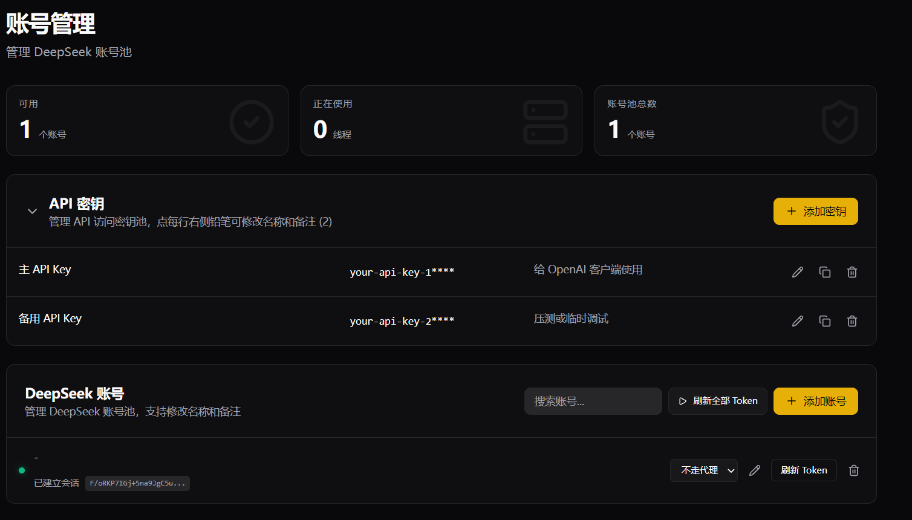

---

## 目录

- [服务器推荐](#服务器推荐)
- [部署教程](#部署教程)
- [使用说明](#使用说明)

---

## 服务器推荐

推荐服务器部署，**不要选择国内地区**，选择 Linux 版本 + Docker 上手快。

| 云厂商 | 推荐地区 | 配置 | 价格 |
|--------|---------|------|------|
| 腾讯云 | **首尔**（推荐）/ 新加坡 / 硅谷 / 东京 | 2 核 4G · 30M 带宽 · 60GB SSD · 1.5T 月流量 | ￥199 / 年 |

> **系统选择 Ubuntu 24**，可以同样价格续费。

[购买地址](https://curl.qcloud.com/oyWDLkRJ)


---

## 部署教程

### 1. 安装 Docker（Ubuntu 24）

```bash
sudo apt update
sudo apt install -y ca-certificates curl gnupg
sudo install -m 0755 -d /etc/apt/keyrings
curl -fsSL https://download.docker.com/linux/ubuntu/gpg | sudo gpg --dearmor -o /etc/apt/keyrings/docker.gpg
sudo chmod a+r /etc/apt/keyrings/docker.gpg
echo \
"deb [arch=$(dpkg --print-architecture) signed-by=/etc/apt/keyrings/docker.gpg] https://download.docker.com/linux/ubuntu \
$(. /etc/os-release && echo "$VERSION_CODENAME") stable" | \
sudo tee /etc/apt/sources.list.d/docker.list > /dev/null
sudo apt update
sudo apt install -y docker-ce docker-ce-cli containerd.io docker-buildx-plugin docker-compose-plugin
sudo docker run hello-world
```

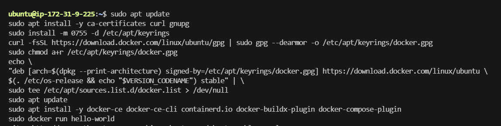

### 2. 下载项目

```bash
git clone https://github.com/CJackHwang/ds2api.git
```

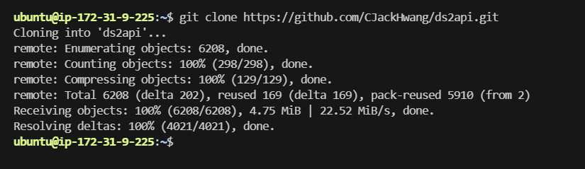

### 3. 进入项目目录

```bash
cd ds2api
```

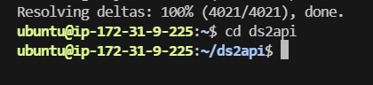

### 4. 创建环境变量文件

在项目目录中创建 `.env` 文件，至少需要设置管理员密钥：

```bash
cat > .env <<'EOF'
DS2API_ADMIN_KEY=123456
EOF
```

> **注意：** 请将 `123456` 替换为一个强密码，以上仅为示例。

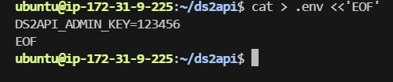

### 5. 创建配置文件

```bash
cp config.example.json config.json
```


### 6. 启动服务

```bash
sudo docker compose up -d
```

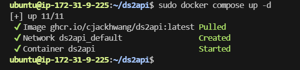

### 7. 访问面板

浏览器打开以下地址：

```
http://你的公网IP:6011
```

> **提示：** 记得在防火墙中放通端口 **6011**。

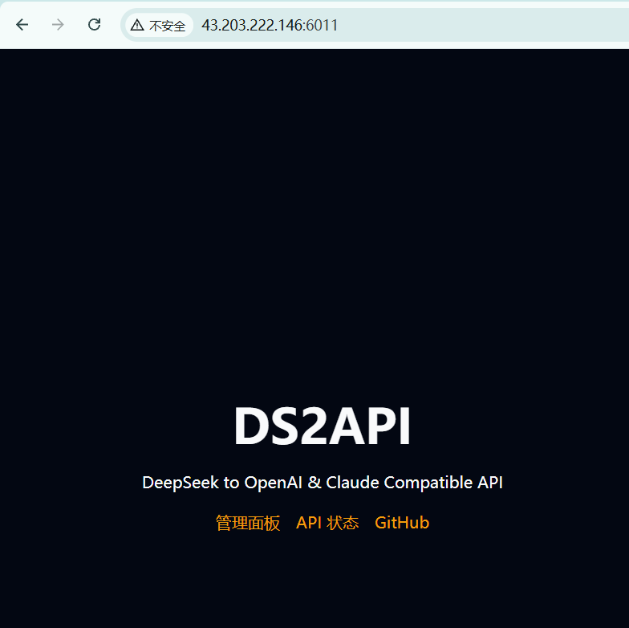

---

## 使用说明

### 登录管理面板

点击「管理面板」，输入之前创建的管理员密码。

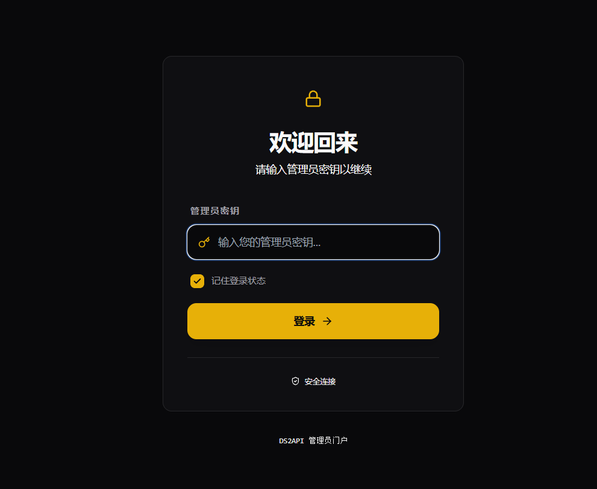

### 添加账号

输入 DeepSeek 手机号和密码：

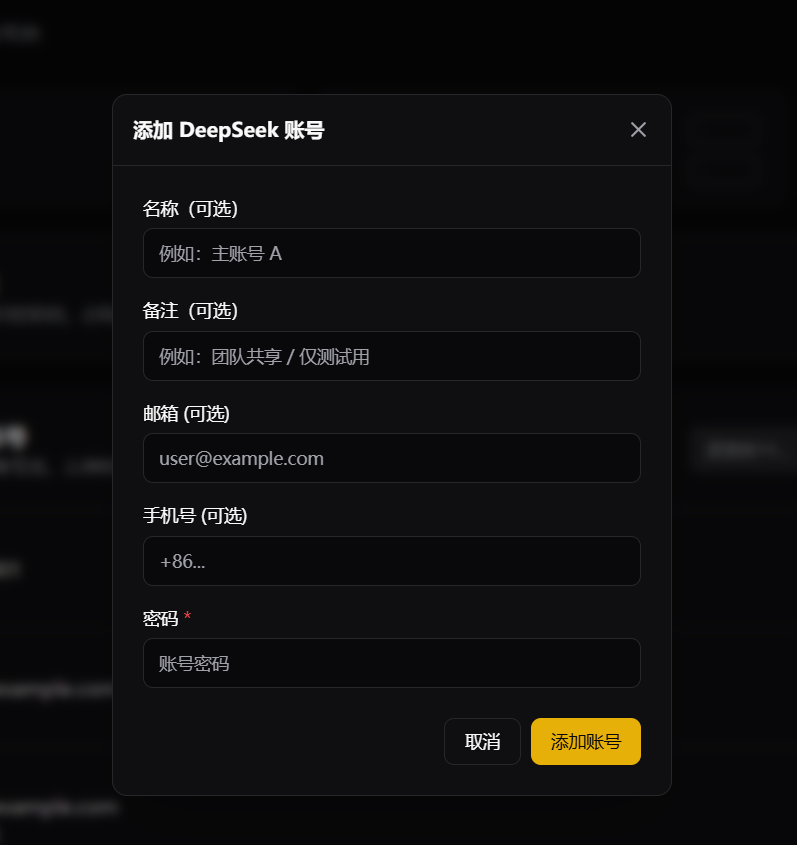

### 添加成功

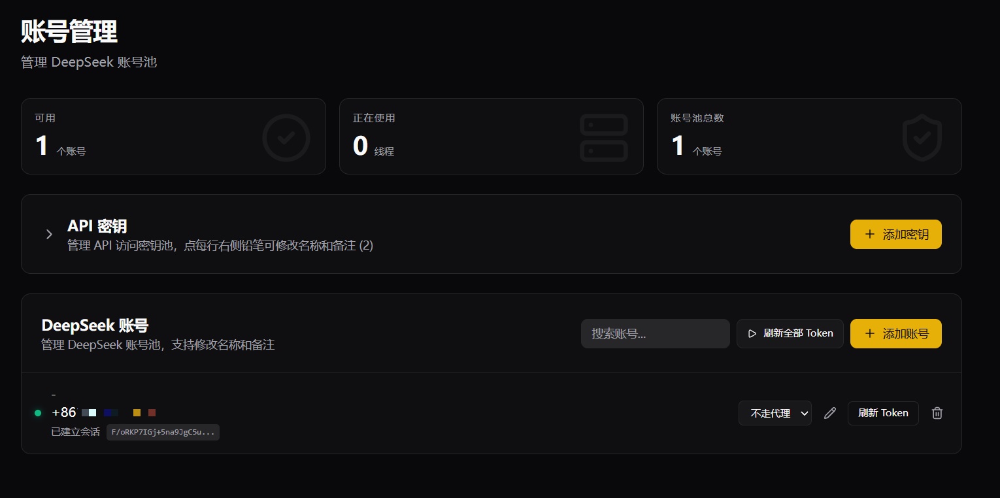

### API 测试

点击「API 测试」验证接口是否正常：

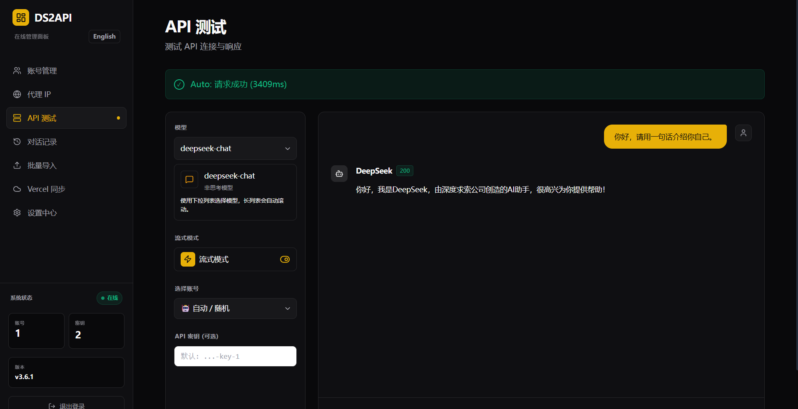

### API 接口信息

| 项目 | 值 |
|------|----|
| 接口地址 | `http://你的公网IP:6011/v1` |
| 模型名称 | `deepseek-chat` |
